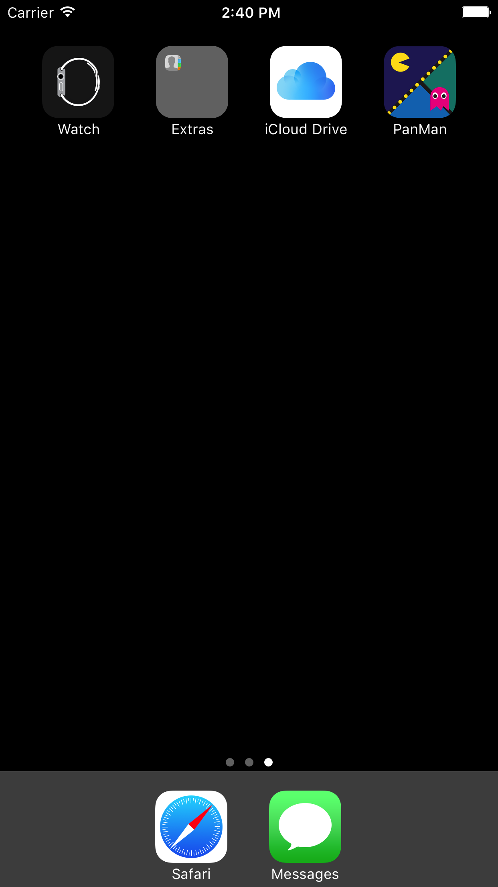
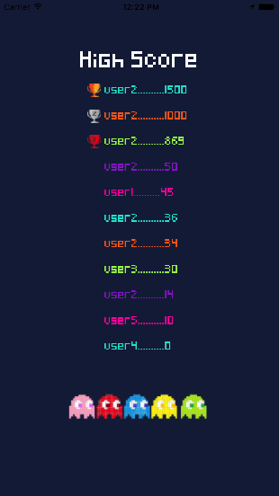

# Pan-Man

----
## Overview
DevBootcamp final project by [Steven Aguilar](https://github.com/Steven2493), [Rakey Drammeh](https://github.com/rdrammeh), [Sofia Forsell](https://github.com/sforsell), [Sara Sulit](https://github.com/sarayapsulit) & [Steven Yuen](https://github.com/steveny91).

----
## About the app
A physical scavenger game built with React Native that utilizes geo location. We created this app to encourage users to get active while having fun! After an 18 week coding journey, Pan-Man is culimination of all our hard work. We had 5 days to build our final project. Before starting this project we had no prior experience with React-Native, and through this project we have learned more about the life cycle of a component, dev-ops, the importance of proper git workflow and improved our abilities of reading the docs. Lastly, we learned a lot about user experience through visual design and technological architectural design. We are really proud of the end result of this project.

----
## Technologies
* [React Native](https://github.com/facebook/react-native)
* [Airbnb/React Native Maps](https://github.com/airbnb/react-native-maps)
* [React Navigation](https://github.com/react-community/react-navigation)
* [Google Directions API](https://developers.google.com/maps/documentation/directions/start)
* [Google Roads API](https://developers.google.com/maps/documentation/roads/intro)
* [Rails API](#)

----
## Deployment
* get API keys from Google
* download xcode from Apple
* after cloning the repo, run `npm install` in the directory.
* add your API keys in their respective places
* `open ios/AwesomeProject.xcodeproj`
* note that the cocoapods file for styling the map is too big for github so please refer to our [presentation deck](https://docs.google.com/presentation/d/1Ly1bhmmMuNi-6uNVu0bu7uoIHMq2s7wNeF9vwvRYriY/edit?usp=sharing) for styling

----
## Control Flow
When the game starts, an array of 50 random coordinates within the frame of the mapview is generated and a request is sent to the Google Roads API to then create the 'candy'. 25 random points out of the 50 coordinates another request is sent to the Google Directions API. This request creates the movement of the ghosts. The ghost's directions request is sent once for each ghost. Proximity between the player and candies/ghosts are checked on a set interval. When the game ends you are taken to a results view where you can choose to play again or go to your personal stats page.

----
## Additional Resources
* [Presentation Deck](https://docs.google.com/presentation/d/1Ly1bhmmMuNi-6uNVu0bu7uoIHMq2s7wNeF9vwvRYriY/edit?usp=sharing)
